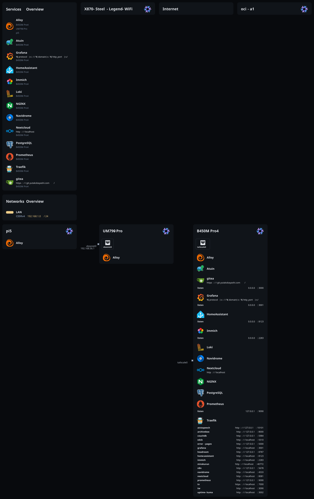
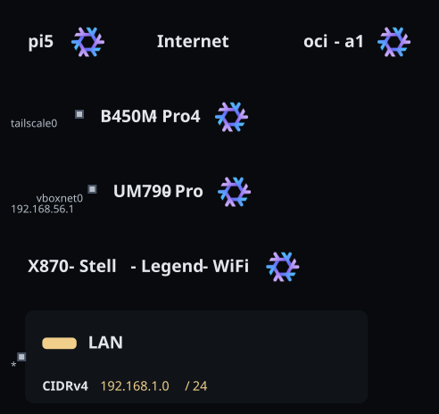

# dotnix

[![DeepWiki](https://img.shields.io/badge/DeepWiki-yutakobayashidev%2Fdotnix-blue.svg?logo=data:image/png;base64,iVBORw0KGgoAAAANSUhEUgAAACwAAAAyCAYAAAAnWDnqAAAAAXNSR0IArs4c6QAAA05JREFUaEPtmUtyEzEQhtWTQyQLHNak2AB7ZnyXZMEjXMGeK/AIi+QuHrMnbChYY7MIh8g01fJoopFb0uhhEqqcbWTp06/uv1saEDv4O3n3dV60RfP947Mm9/SQc0ICFQgzfc4CYZoTPAswgSJCCUJUnAAoRHOAUOcATwbmVLWdGoH//PB8mnKqScAhsD0kYP3j/Yt5LPQe2KvcXmGvRHcDnpxfL2zOYJ1mFwrryWTz0advv1Ut4CJgf5uhDuDj5eUcAUoahrdY/56ebRWeraTjMt/00Sh3UDtjgHtQNHwcRGOC98BJEAEymycmYcWwOprTgcB6VZ5JK5TAJ+fXGLBm3FDAmn6oPPjR4rKCAoJCal2eAiQp2x0vxTPB3ALO2CRkwmDy5WohzBDwSEFKRwPbknEggCPB/imwrycgxX2NzoMCHhPkDwqYMr9tRcP5qNrMZHkVnOjRMWwLCcr8ohBVb1OMjxLwGCvjTikrsBOiA6fNyCrm8V1rP93iVPpwaE+gO0SsWmPiXB+jikdf6SizrT5qKasx5j8ABbHpFTx+vFXp9EnYQmLx02h1QTTrl6eDqxLnGjporxl3NL3agEvXdT0WmEost648sQOYAeJS9Q7bfUVoMGnjo4AZdUMQku50McDcMWcBPvr0SzbTAFDfvJqwLzgxwATnCgnp4wDl6Aa+Ax283gghmj+vj7feE2KBBRMW3FzOpLOADl0Isb5587h/U4gGvkt5v60Z1VLG8BhYjbzRwyQZemwAd6cCR5/XFWLYZRIMpX39AR0tjaGGiGzLVyhse5C9RKC6ai42ppWPKiBagOvaYk8lO7DajerabOZP46Lby5wKjw1HCRx7p9sVMOWGzb/vA1hwiWc6jm3MvQDTogQkiqIhJV0nBQBTU+3okKCFDy9WwferkHjtxib7t3xIUQtHxnIwtx4mpg26/HfwVNVDb4oI9RHmx5WGelRVlrtiw43zboCLaxv46AZeB3IlTkwouebTr1y2NjSpHz68WNFjHvupy3q8TFn3Hos2IAk4Ju5dCo8B3wP7VPr/FGaKiG+T+v+TQqIrOqMTL1VdWV1DdmcbO8KXBz6esmYWYKPwDL5b5FA1a0hwapHiom0r/cKaoqr+27/XcrS5UwSMbQAAAABJRU5ErkJggg==)](https://deepwiki.com/yutakobayashidev/dotnix)

## Target

| Machine                   | Name                       | Description                      | OS                     | System         | Stable |
| ------------------------- | -------------------------- | -------------------------------- | ---------------------- | -------------- | ------ |
| B450M Pro4                | B450M-Pro4                 | Self-hosted services and storage | NixOS                  | x86_64-linux   | ◎      |
| UM790 Pro                 | UM790-Pro                  | Dev mini PC and AI agent host    | NixOS                  | x86_64-linux   | ◎      |
| ThinkPad X1 Carbon Gen 13 | ThinkPad-X1-Carbon-Gen13   | Mobile development workstation   | NixOS                  | x86_64-linux   | △      |
| X870 Steel Legend WiFi    | X870-Steel-Legend-WiFi     | Gaming and GPU server            | NixOS                  | x86_64-linux   | △      |
| X870 Steel Legend WiFi    | X870-Steel-Legend-WiFi-WSL | Windows WSL dev environment      | NixOS (WSL)            | x86_64-linux   | ◎      |
| Pi 5                      | pi5                        | Headless Raspberry Pi 5          | NixOS                  | aarch64-linux  | △      |
| OCI Ampere A1 VM          | oci-a1                     | Remote ARM builder VM            | NixOS                  | aarch64-linux  | △      |
| M2 MacBook Air            | M2-MacBook-Air             | macOS laptop workstation         | macOS                  | aarch64-darwin | ◎      |
| Galaxy S23 FE             | Galaxy-S23FE               | Android nix-on-droid environment | Android (nix-on-droid) | aarch64-linux  | △      |

## Module Structure

```
flake.nix                    # Entry point and host table
flake-module.nix             # Generates nixos/darwin/nix-on-droid outputs from hosts
├── systems/
│   ├── common.nix               # Shared system imports and activation hooks
│   ├── nixos/
│   │   ├── common.nix           # Shared NixOS host imports
│   │   ├── desktop.nix          # Shared NixOS desktop system settings
│   │   ├── laptop.nix           # Shared NixOS laptop system settings
│   │   ├── fonts.nix            # Shared NixOS font settings
│   │   ├── input-method.nix     # Shared NixOS input method settings
│   │   ├── services/            # Host/system service bundles (microVMs, secrets, etc.)
│   │   ├── installer/            # Custom x86_64 NixOS installer ISO
│   │   ├── B450M-Pro4/           # NixOS host config (services, disko, impermanence)
│   │   ├── UM790-Pro/           # NixOS host config (boot, network, locale)
│   │   ├── ThinkPad-X1-Carbon-Gen13/   # NixOS laptop host config
│   │   ├── X870-Steel-Legend-WiFi/   # NixOS desktop host config
│   │   ├── X870-Steel-Legend-WiFi-WSL/   # NixOS-WSL host config (WSL, locale)
│   │   ├── pi5/                 # NixOS host config (headless Pi 5)
│   │   └── oci-a1/              # OCI Ampere A1 NixOS host config (disko, boot, network)
│   ├── darwin/
│   │   ├── common.nix           # Shared macOS host imports
│   │   ├── desktop.nix          # Shared macOS desktop system settings
│   │   ├── homebrew.nix         # Shared macOS Homebrew app set
│   │   └── M2-MacBook-Air/      # macOS host config
│   └── android/
│       ├── common.nix           # Shared nix-on-droid configuration
│       └── Galaxy-S23FE/        # nix-on-droid host config
├── homes/
│   ├── common.nix               # Shared Home Manager glue
│   ├── nixos/                   # NixOS Home Manager host config
│   ├── darwin/                  # macOS Home Manager host config
│   └── android/                 # nix-on-droid home hook
├── applications/                # Directly imported Home Manager app configs (git, tmux, browsers, niri, misc)
├── modules/
│   ├── features/        # Typed NixOS, nix-darwin, and Home Manager feature registries
│   ├── profiles/        # Typed profile bundles with optional system-to-home cascade
│   └── per-system/      # Packages, devshell, checks, and formatter configuration
├── lib/                 # Profile builder and shared evaluation helpers
├── overlays/            # Custom packages (overlay)
├── agents/                  # Agent skills config docs (skills: github:yutakobayashidev/skills)
└── zsh/                     # Zsh config
```

Home Manager deploys repository-backed configuration from the flake source in the Nix store. Initial activation does not require a checkout at the configured `ghq` path; clone the repository only when making or applying later changes.

## Documentation

### System Installation Guides

- [docs/installer-iso.md](docs/installer-iso.md) - Build and write the custom NixOS installer ISO
- [docs/systems/B450M-Pro4.md](docs/systems/B450M-Pro4.md) - NixOS installation guide
- [docs/systems/UM790Pro.md](docs/systems/UM790Pro.md) - NixOS installation guide
- [docs/systems/ThinkPad-X1-Carbon-Gen13.md](docs/systems/ThinkPad-X1-Carbon-Gen13.md) - NixOS dual-boot installation guide
- [docs/systems/X870-Steel-Legend-WiFi.md](docs/systems/X870-Steel-Legend-WiFi.md) - NixOS-WSL installation guide
- [docs/systems/Pi5.md](docs/systems/Pi5.md) - NixOS installation guide for Raspberry Pi 5
- [docs/systems/M2-MacBook-Air.md](docs/systems/M2-MacBook-Air.md) - nix-darwin installation guide for macOS
- [docs/systems/Galaxy-S23FE.md](docs/systems/Galaxy-S23FE.md) - nix-on-droid installation guide for Android

### Operations

- [docs/B450M-Pro4-HDD-service-storage.md](docs/B450M-Pro4-HDD-service-storage.md) - B450M-Pro4 HDD service storage setup
- [docs/B450M-Pro4-s3s.md](docs/B450M-Pro4-s3s.md) - s3s (Splatoon 3 stats uploader) workflow
- [docs/hermes-agent-discord.md](docs/hermes-agent-discord.md) - Discord setup for the UM790-Pro Hermes Agent microVM

### Other

- [docs/music-workflow.md](docs/music-workflow.md) - CD ripping and music library management

## Daily Usage

```sh
# Apply changes (NixOS or macOS)
nix run .#switch

# Build without applying
nix run .#build

# Format all files (nix, lua, sh)
nix run .#fmt

# Update flake inputs
nix flake update
```

## Available Nix Apps

### NixOS

- `nix run .#switch` - Build and apply NixOS + Home Manager configuration (`sudo nixos-rebuild switch`)
- `nix run .#build` - Build configuration without applying
- `nix run .#fmt` - Format configured file types (Nix, Lua, shell, TOML, Python, etc.) via [treefmt](https://github.com/numtide/treefmt-nix)

### macOS

- `nix run .#switch` - Build and apply nix-darwin + Home Manager configuration (`sudo darwin-rebuild switch`)
- `nix run .#build` - Build configuration without applying
- `nix run .#fmt` - Format configured file types (Nix, Lua, shell, TOML, Python, etc.) via [treefmt](https://github.com/numtide/treefmt-nix)

Both use [nix-output-monitor](https://github.com/maralorn/nix-output-monitor) for build output.

## Key Features

### NixOS

- **WM**: [Niri](https://github.com/YaLTeR/niri) (scrollable tiling Wayland compositor)
- **Launcher**: [Vicinae](https://github.com/vicinaehq/vicinae)
- **Wallpaper**: swaybg with a declarative Home Manager feature
- **IME**: fcitx5 + [hazkey](https://github.com/aster-void/nix-hazkey) (LLM-powered Japanese input)
- **Personal context**: Screenpipe CLI and desktop app, built from source through the personal NUR
- **Audio production**: Bitwig Studio, native synths/effects, and Windows VST support via PipeWire JACK and yabridge
- **YubiKey**: PAM U2F authentication (polkit, swaylock)
- **Development**: Docker, Tailscale, Android development environment, VirtualBox on UM790-Pro
- **Remote MCP**: [Sandboxed local tools on UM790-Pro](docs/local-mcp-tunnel.md) through an OpenAI Secure MCP Tunnel
- **Self-hosted services**: Nextcloud, Immich, Gitea, Home Assistant, ArchiveBox, n8n, WebHashtag, Grafana, Prometheus, Loki, Claude Code telemetry, Twitter API Safe Relay with Secure MCP Tunnel, and comin on B450M-Pro4
- **Agent microVMs**: Hermes Agent on UM790-Pro (Slack and Discord) and OpenClaw on B450M-Pro4 via microvm.nix

### macOS

- **Homebrew**: GUI app management via casks (Ghostty, Chrome, OrbStack, etc.)
- **brew-nix**: Homebrew cask packages managed as Nix packages (version pinning & rollback)
- **Touch ID**: sudo authentication support
- **1Password**: Shell Plugins (gh, awscli2)

## Managed Tools

- **AI Development**: claude-code, codex, grok, opencode, pi, ccusage
- **Version Control**: git, lazygit, jujutsu (jj), git-lfs, git-wt
- **Core CLI**: ripgrep, fzf, jq, zoxide, lsd, btop, yazi, tmux
- **Communication**: halloy (IRC)
- **Editors**: Neovim, VSCode
- **Terminal**: Ghostty, Zsh + Oh My Zsh
- **Network**: nmap, bandwhich, speedtest-cli

## Agent Skills

Agent skills are managed via [agent-skills-nix](https://github.com/Kyure-A/agent-skills-nix).

Avoid maintaining a fixed skill list here. Treat the agent-skills Nix modules as the source of truth.

## Topology


_Main topology diagram_


_Network overview diagram_

Generated with [`nix-topology`](https://github.com/oddlama/nix-topology).

```sh
nix build .#topology.x86_64-linux.config.output --out-link result
```

## Templates

Project templates are managed in [ashiba](https://github.com/yutakobayashidev/ashiba). See the repository for available templates.
